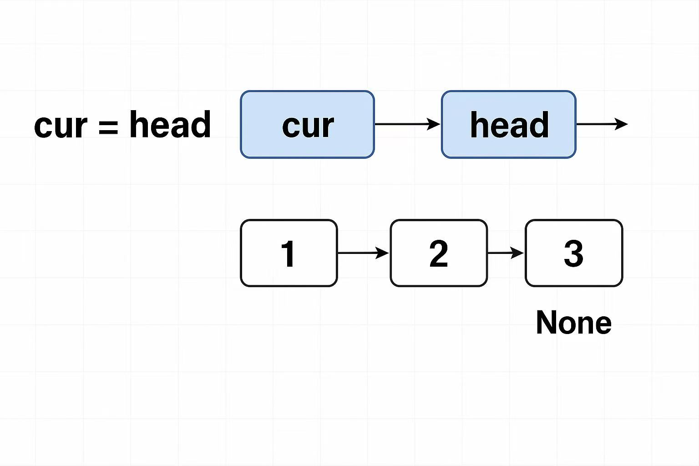

# DAY 3｜203. Remove Linked List Elements 707. Design Linked List 206. Reverse Linked List
## 学习内容
[链表理论基础](https://programmercarl.com/%E9%93%BE%E8%A1%A8%E7%90%86%E8%AE%BA%E5%9F%BA%E7%A1%80.html)
[203讲解](https://programmercarl.com/0203.%E7%A7%BB%E9%99%A4%E9%93%BE%E8%A1%A8%E5%85%83%E7%B4%A0.html)
[707讲解](https://programmercarl.com/0707.%E8%AE%BE%E8%AE%A1%E9%93%BE%E8%A1%A8.html)
[206讲解](https://programmercarl.com/0206.%E7%BF%BB%E8%BD%AC%E9%93%BE%E8%A1%A8.html)
``` python
class ListNode:
    def __init__(self, val, next=None):
        self.val = val
        self.next = next
```
## 203. Remove Linked List Elements
[Leetcode Link](https://leetcode.cn/problems/remove-linked-list-elements/description/)-Easy
### Description
>Given the head of a linked list and an integer val, remove all the nodes of the linked list that has Node.val == val, and return the new head.
>>**Example 1:**
>>**Input:** head = `[1,2,6,3,4,5,6]`, val = 6
>>**Output:** `[1,2,3,4,5]`
### Code
#### Method1 虚拟头节点
>创建虚拟头节点，当如果要删除头节点的时候，不用单独处理头节点，使删除操作统一。
```python
class Solution:
    def removeElements(self, head: Optional[ListNode], val: int) -> Optional[ListNode]:
        dummyhead = ListNode(next = head)
        cur = dummyhead
        while cur.next:
            if cur.next.val == val:
                cur.next = cur.next.next
            else:
                cur = cur.next
        return dummyhead.next
```
> - Time: O(N)
> - Space: O(1)
#### Method2 头节点
```python
class Solution:
    def removeElements(self, head: Optional[ListNode], val: int) -> Optional[ListNode]:
        while head and head.val == val:
            head = head.next
        
        cur = head
        while cur and cur.next:
            if cur.next.val == val:
                cur.next = cur.next.next
            else:
                cur = cur.next
        return head
```
> - Time: O(N)
> - Space: O(1)
## 707. Design Linked List
[Leetcode Link](https://leetcode.cn/problems/design-linked-list/description/)-Medium
### Description
>Design your implementation of the linked list. You can choose to use a singly or doubly linked list.
>A node in a singly linked list should have two attributes: val and next. val is the value of the current node, and next is a pointer/reference to the next node.
>If you want to use the doubly linked list, you will need one more attribute prev to indicate the previous node in the linked list. Assume all nodes in the linked list are 0-indexed.
>Implement the MyLinkedList class:
>MyLinkedList() Initializes the MyLinkedList object.
>int get(int index) Get the value of the indexth node in the linked list. If the index is invalid, return -1.
>void addAtHead(int val) Add a node of value val before the first element of the linked list. After the insertion, the new node will be the first node of the linked list.
>void addAtTail(int val) Append a node of value val as the last element of the linked list.
>void addAtIndex(int index, int val) Add a node of value val before the indexth node in the linked list. If index equals the length of the linked list, the node will be appended to the end of the linked list. If index is greater than the length, the node will not be inserted.
>void deleteAtIndex(int index) Delete the indexth node in the linked list, if the index is valid.
>>**Example 1:**
>>**Input**["MyLinkedList", "addAtHead", "addAtTail", "addAtIndex", "get", "deleteAtIndex", "get"]
>>`[[], [1], [3], [1, 2], [1], [1], [1]]`
>>**Output**`[null, null, null, null, 2, null, 3]`
>>**Explanation**
>>MyLinkedList myLinkedList = new MyLinkedList();
>>myLinkedList.addAtHead(1);
>>myLinkedList.addAtTail(3);
>>myLinkedList.addAtIndex(1, 2);    // linked list becomes 1->2->3
>>myLinkedList.get(1);              // return 2
>>myLinkedList.deleteAtIndex(1);    // now the linked list is 1->3
>>myLinkedList.get(1);              // return 3
### Code
>链表的增删，主要注意index的位置增和删都在cur.next,前一个节点是cur。还学习了链表的遍历，while和for循环都可以，cur = cur.next。
>增加节点的时候要注意先把新节点指向下一个节点，再把上一个节点指向新节点。
>如果改变顺序，因为新节点指向cur.next但是cur.next已经被改变了，因为新节点插在cur.next前面。
```python
class ListNode():
    def __init__(self,val = 0, next = None):
        self.val = val
        self.next = next

class MyLinkedList:

    def __init__(self):
        self.dummyhead = ListNode()
        self.size = 0

    def get(self, index: int) -> int:
        if index <0 or index >= self.size:
            return -1
        cur = self.dummyhead
        while index >= 0:
            cur = cur.next
            index -= 1
        return cur.val

    def addAtHead(self, val: int) -> None:
        new_node = ListNode(val = val)
        new_node.next = self.dummyhead.next
        self.dummyhead.next = new_node
        self.size += 1

    def addAtTail(self, val: int) -> None:
        new_node = ListNode(val = val)
        cur = self.dummyhead
        while cur.next:
            cur = cur.next
        cur.next = new_node
        self.size += 1

    def addAtIndex(self, index: int, val: int) -> None:
        if index < 0 or index > self.size:
            return
        new_node = ListNode(val = val)
        cur = self.dummyhead
        while index > 0:
            cur = cur.next
            index -= 1
        new_node.next = cur.next
        cur.next = new_node
        self.size += 1

    def deleteAtIndex(self, index: int) -> None:
        if index <0 or index >= self.size:
            return -1
        cur = self.dummyhead
        while index > 0:
            cur = cur.next
            index -= 1
        cur.next = cur.next.next 
        self.size -= 1


# Your MyLinkedList object will be instantiated and called as such:
# obj = MyLinkedList()
# param_1 = obj.get(index)
# obj.addAtHead(val)
# obj.addAtTail(val)
# obj.addAtIndex(index,val)
# obj.deleteAtIndex(index)
```
## 206. Reverse Linked List
[Leetcode Link](https://leetcode.cn/problems/reverse-linked-list/description/)-Easy
### Description
>Given the head of a singly linked list, reverse the list, and return the reversed list.
>>**Example 1:**
>>**Input:** head = [1,2,3,4,5]
>>**Output:** [5,4,3,2,1]
### Code
#### Method1 双指针
>定义一个在head节点前面的pre节点指向None，因为翻转链表，指针最后需要指向None。
>在遍历时需要有一个temp节点保存cur.next，不然翻转第一个节点的时候，cur还没有向后移动，cur.next已经没有了。
```python
class Solution:
    def reverseList(self, head: Optional[ListNode]) -> Optional[ListNode]:
        current = head
        pre = None 
        while current:
            temp = current.next # 保存一下 cur的下一个节点，因为接下来要改变cur->next
            current.next = pre
            pre = current
            current = temp
        
        return pre
```
> - Time: O(N)
> - Space: O(1)
#### Method2 递归
>递归法在双指针的基础上，把两个指针cur和pre当作递归函数的参数。递归终止条件为当cur移动到None的时候。
```python
class Solution:
    def reverseList(self, head: Optional[ListNode]) -> Optional[ListNode]:
        return self.reverse(head,None)
    
    def reverse(self,cur,pre):
        if cur is None:
            return pre
        temp = cur.next
        cur.next = pre
        
        return self.reverse(temp,cur)
```
> - Time: O(N)
> - Space: O(1)
## 今日心得
- 学习了新的数据结构链表，一开始看代码非常懵，为什么cur = head，都在cur上操作最后return head。以为和数组一样都是赋值，head就是链表，赋给cur之后是复制链表。
- head是链表的头节点，指向链表，cur = head相当于把头节点赋给了cur，指向同一个链表。链表节点是通过内存地址传递的而非值传递，即cur和head指向相同地址。
- 学习了dummy_head虚拟头节点可以保持处理逻辑统一，还有翻转链表双指针法！!这道题重点刷。
- 
